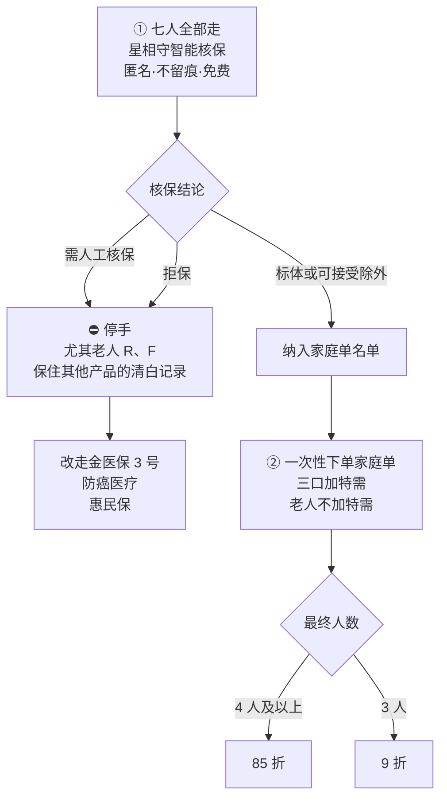
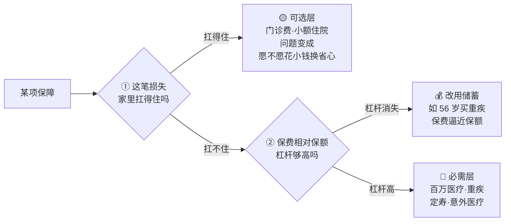

# 全家七口保险方案

> 核心三口 + 四位老人的完整投保方案。**打开即结论**，详细推演见下方文档链接。
>
> 更新日期：2026-08-10 ｜ 家庭年收入区间：25～35 万 ｜ 必需层保费占比：约 5%～7%

---

## 一、一页总表：七个人买什么

图例：✅ 已完成 ｜ 🔴 待办（可立即） ｜ ⏳ 待窗口开放 ｜ ❌ 明确不买

### 核心三口

| 成员 | 险种 | 产品与配置 | 年保费 | 状态 |
| :--- | :--- | :--- | ---: | :---: |
| **你** 32 岁女 | 意外 | 小蜜蜂 6 号 50 万 | 156 | ✅ |
| | 百万医疗 | 星相守 2 号 1 万免赔 **+ 重疾特需** | **387** | 🔴 |
| | 重疾 | **超级玛丽 16 号 Pro** 50 万 / 保至 70 岁 | ~4,000–4,500 | 🔴 |
| | 定期寿险 | **定海柱 8 号** 100 万 / 保 30 年 | ~650 | 🔴 |
| | 惠民保 | 西湖益联保（补被除外的乳腺/妇科） | 150 | ⏳ 11 月 |
| **先生** 30 岁男 | 意外 | 小蜜蜂 6 号 100 万 | 300 | ✅ |
| | 百万医疗 | 星相守 2 号 1 万免赔 **+ 重疾特需** | **284** | 🔴 |
| | 重疾 | 达尔文 12 号 50 万 / 保至 70 岁 | ~4,300 | 🔴 |
| | 定期寿险 | **擎天柱 12 号·泰然一生版** 100 万 / 保 30 年 | ~1,112 | 🔴 |
| | 惠民保 | 西湖益联保（补息肉除外部分） | 150 | ⏳ 11 月 |
| **宝宝** 1 岁男 | 意外 | 小顽童 8 号 + 骨折/关节脱位 | 78+ | ✅ |
| | 百万医疗 | 星相守 2 号 1 万免赔 **+ 重疾特需** | **412** | 🔴 |
| | 少儿重疾 | **麦兜兜 2026** 100 万 / 保 30 年 | ~450 | 🔴 |
| | 门诊 | **签约家庭医生**（社区报销 73%、免 300 元起付线） | **0** | 🔴 |

### 四位老人

> 统一原则：**不买重疾险、不买定期寿险**（此年龄段重疾杠杆已消失，老人亦无抚养责任）。

| 成员 | 险种 | 产品与配置 | 年保费 | 状态 |
| :--- | :--- | :--- | ---: | :---: |
| **老人 Z** 56 岁女 | 意外 | 孝心安 6 号 | 238 | ✅ |
| | 百万医疗 | 金医保 3 号（**四人中最有希望过核保**） | ~1,500–2,000 | 🔴 |
| | └ 退路 | 蓝医保·终身防癌医疗 | ~600–900 | — |
| | 惠民保 | 惠厦保 | 129 | ⏳ 2027/4 |
| **老人 R** 近 60 岁男 | 意外 | 孝心安 6 号 | 238–288 | ✅ |
| | 防癌医疗 | **蓝医保·终身防癌医疗**（三高可投） | ~800–1,200 | 🔴 |
| | 惠民保 | 皖惠保 | 60–66 | ⏳ 2026/10 |
| | 社保 | **医保异地就医备案**（皖 → 杭） | **0** | 🔴 |
| **老人 F** 56 岁男 | 意外 | 孝心安 6 号 | 238 | ✅ |
| | **社保** | **补缴职工医保锁定终身医保**（全家回报最高的一步） | 按当地 | 📌 4 年后 |
| | 惠民保 | **惠厦保**（唯一确定能买到的医疗保障） | 129 | ⏳ 2027/4 |
| **老人 G** 55+ 岁女 | 意外 | 孝心安 6 号 | 188–238 | ✅ |
| | 惠民保 | 皖惠保（已有，**务必续保**） | 60–66 | ⏳ 2026/10 |
| | 百万医疗 | 金医保 3 号（55 岁+ 免人工审核） | ~1,800–2,400 | 🔴 |

### 预算合计

| 项目 | 金额 |
| :--- | ---: |
| ✅ 已完成（意外层 7 人） | 约 1,440–1,540 |
| 🔴 三口医疗 + 重疾 + 定寿 + 惠民保 | 约 11,550 |
| 🔴 四老医疗/防癌 + 惠民保 | 约 3,700–4,900 |
| **全家合计** | **约 16,700–18,000 元/年** |

---

## 二、❌ 明确不买的六项（省下约 2,000 元/年）

| 不买 | 一句话理由 |
| :--- | :--- |
| 老人的**重疾险、定期寿险** | 56 岁买 50 万重疾保费逼近保额，**杠杆趋近于 1**；老人无抚养责任 |
| **基础医疗保险金**（三人） | 被 0 免赔严格支配——每买 1 个百分点报销比例的成本都更贵 |
| **0 免赔升级**（三人） | 大人期望赔付仅为差价 1/3；宝宝 20 年总账只回收 74% |
| **附加门急诊** | 200 元单次免赔，把儿童最高频的小额门诊全挡在外面 |
| 宝宝的**西湖益联保** | 惠民保随时可买、不产生未来权益，且各维度全面弱于星相守 |
| **暖宝保 3 号** | 意外责任与小顽童 8 号重复，独有价值窄 |

---

## 三、⚡ 现在就做：三件事

### 1️⃣ 先核保，别下单（顺序错了不可逆）

星相守 2 号家庭单**不支持中途加人**，也不支持多张个人单合并。一旦三口先下单，四位老人就永远加不进来。

> **智能核保随便试，正式投保只做一次。** 前者非实名、不留记录；后者一旦被拒，记录跟着人走，后续所有产品的健康告知都要如实申报。

### 2️⃣ 你的核保结论决定全家家庭单归属

你有甲状腺结节、乳腺结节 2 类、多发子宫肌瘤，三家产品的除外范围差异很大：

| 产品 | 对乳腺结节 2 类的预期结论 | 评价 |
| :--- | :--- | :--- |
| **星相守 2 号** | 有机会**标体承保**、不加价 | 🥇 最优，且条款约定"如实告知且核保通过的疾病不算既往症" |
| 好医保长期医疗 | 除外结节，**但仍保乳腺恶性肿瘤** | 🥈 稳妥退路 |
| 蓝医保 | 除外**含甲状腺/乳腺恶性肿瘤** | ❌ 排除，且 55 岁以下无人工核保通道 |

⚠️ 子宫肌瘤未手术，**四款产品大概率都会除外妇科**——这部分缺口由西湖益联保（不限既往症）补位。

### 3️⃣ 零成本的三个动作

- 给**宝宝签约家庭医生** → 社区就医报销提到 73%，直接免掉 300 元起付线
- 给**老人 R 办医保异地就医备案** → 皖杭两地就医必办
- 记下**老人 F 的社保补缴时点** → 4 年后按时足额补缴，锁定终身医保

---

## 四、⏰ 时间窗口：惠民保三地目前全部关闭

惠民保一年一次、错过等一年，且是带病成员的关键兜底。

| 惠民保 | 谁需要 | 2026 年度窗口 | 当前 | 下次开放 |
| :--- | :--- | :--- | :---: | :--- |
| 西湖益联保 | 你、先生 | 2025/11/6 – 2026/2/10 | ❌ 已截止 | **2026 年 11 月** |
| 皖惠保 | 老人 R、G | 2025/10/22 – 2025/12/31 | ❌ 已截止 | **2026 年 10 月** |
| 惠厦保 | 老人 Z、F | 2026/4/22 – 2026/6/30 | ❌ 已截止 | **2027 年 4 月** |

| 时点 | 必办事项 |
| :--- | :--- |
| **本周** | 七人星相守智能核保 + 老人金医保 3 号核保 |
| **本月** | 家庭单一次性下单；三口重疾/定寿；老人 R 防癌医疗；两个零成本动作 |
| **2026/10** | 皖惠保 —— 老人 R 新参保、**老人 G 续保（现保障 12/31 到期，别断档）** |
| **2026/11** | 西湖益联保 —— 你 + 先生参保（先生首次） |
| **2027/4** | 惠厦保 —— 老人 Z、**老人 F（他最关键的一环）** |
| **4 年后** | 老人 F 补缴职工医保 |

---

## 五、决策框架：为什么这么配

所有取舍都用同一套标准，两个判断**都通过**才进必需层。

**可选层内部各项地位平等**——门诊险、基础医疗保险金、0 免赔升级、骨折专项，全都是"非必需"，彼此只比价格和偏好，不存在"这个该买那个不该买"的原则差异。

**惠民保要因人而异**：对被除外承保的人（你、先生）和商业险无望的人（老人 F）它是**必需层**；对健康且商业医疗齐全的宝宝，它接近无用。

---

## 六、文档索引

| 文档 | 内容 |
| :--- | :--- |
| [全家七口保险购买组合方案（脱敏版）](./全家七口保险购买组合方案（脱敏版）.md) | 完整推演：逐人分析、四款百万医疗对比、核保指南、渠道核验、可选责任测算 |
| [一家三口保险配置推荐：关哥说险 vs 深蓝保](./一家三口保险配置推荐：关哥说险%20vs%20深蓝保.md) | 通用方法论：两种流派的对比与标准三口之家配置 |

---

## 七、数据可信度

| 标记 | 含义 | 本文哪些内容 |
| :---: | :--- | :--- |
| 🟢 | **实际报价/官方规则**，可直接用 | 星相守三口报价（用户实测）、监管规定、医保报销比例、惠民保窗口 |
| 🟡 | **公开测评交叉验证**，投保页复核 | 承保公司、产品责任、老人参考费率 |
| 🟠 | **本文推算**，仅供参考 | 核保结论预判、住院率假设、期望值测算、儿童费率曲线 |

> **免责声明**：本文为个人保险配置整理，不构成投保建议。核保结论以保险公司实际审核为准；保费以投保时页面报价为准；惠民保规则以当年当地官方公告为准。产品迭代频繁，投保前请核对在售版本的条款与健康告知。
