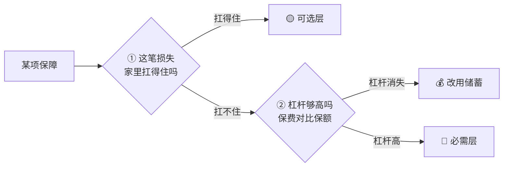
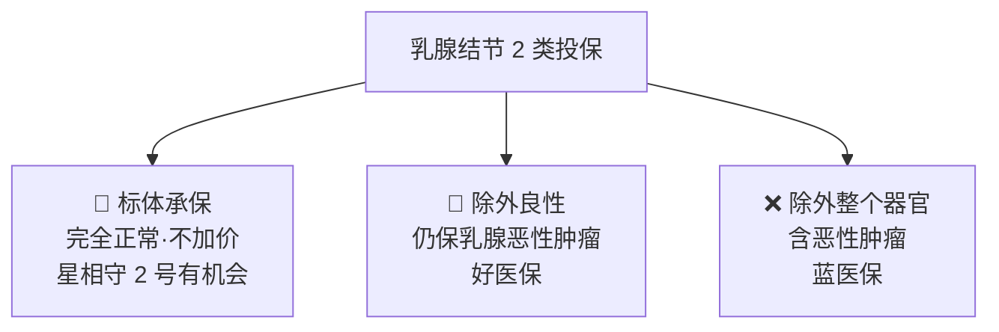

# 全家七口保险购买组合方案（脱敏版）

> 本文是 [README 总表](./README.md) 的完整推演。README 给结论，本文给理由。
>
> 更新日期：2026-08-10

**目录**

1. [家庭画像与决策框架](#一家庭画像与决策框架)
2. [逐人方案详解](#二逐人方案详解)
3. [百万医疗四款横评](#三百万医疗四款横评)
4. [星相守 2 号可选责任测算](#四星相守-2-号可选责任测算)
5. [家庭单规则与老人并入](#五家庭单规则与老人并入)
6. [带病投保与核保指南](#六带病投保与核保指南)
7. [购买渠道与真实性核验](#七购买渠道与真实性核验)
8. [已排除项及理由](#八已排除项及理由)
9. [数据可信度与来源](#九数据可信度与来源)

---

## 一、家庭画像与决策框架

### 1.1 七人风险总览

| 成员 | 基础医保 | 健康情况 | 投保难度 |
| :--- | :--- | :--- | :---: |
| 女 32 岁（本人） | 杭州职工医保 + 西湖益联保 | 甲状腺轻度结节、乳腺结节 2 类、多发小子宫肌瘤，已育 | ★★★ |
| 男 30 岁（家属） | 杭州职工医保 | 内脏小息肉，定期复查无异常 | ★★ |
| 男宝 1 岁 | 杭州少儿医保 | 健康 | ★ |
| 老人 Z（56 女） | 厦门职工医保 + 退休金 | 子宫肌瘤微创术史、关节退化 | ★★★ |
| 老人 R（近 60 男） | 安徽职工医保 + 退休金，皖杭两地 | 三高基础病 | ★★★★ |
| 老人 F（56 男） | 厦门职工医保（4 年后可补缴享终身） | 胃大出血术史、肝脏状况不佳 | ★★★★★ |
| 老人 G（55+ 女） | 安徽城乡居民医保 + 皖惠保 | 膝盖封闭针、宫腔镜术史 | ★★★ |

### 1.2 决策框架：两个判断，都通过才是必需

| 层级 | 判断问题 | 典型内容 | 结论 |
| :--- | :--- | :--- | :--- |
| 🔴 **必需层** | 这笔损失家里扛不扛得住？ | 大病住院几十万、重疾后收入与护理缺口、意外致残 | 扛不住 → **必须保**，与性价比无关 |
| 🟡 **可选层** | 愿不愿意花小钱换省心？ | 门诊费、1 万免赔以下小额住院、骨折营养误工费 | 扛得住 → **都非必需**。本质是"预付小钱换报销"，扣掉渠道费和利润后长期期望值为负 |
| 💰 **储蓄替代** | 保费逼近保额时 | 56 岁买 50 万重疾 | **保险失效**，直接存钱更优 |

**两条推论**

- **可选层内部各项地位平等**：门诊险、基础医疗保险金、0 免赔升级、骨折专项、暖宝保——全是"非必需"，彼此只比价格和偏好，不存在原则性差异。
- **四位老人不配重疾、不配寿险**：不是老人不重要，而是这个年龄段重疾险的杠杆已经消失（同时老人无抚养责任，寿险失去意义）。省下的钱直接存着，效果好过一份杠杆为 1 的保单。

对照验证：

| 案例 | ① 风险 | ② 杠杆 | 结论 |
| :--- | :---: | :---: | :--- |
| 30 岁男买 50 万重疾（4,300 元/年） | ✅ 扛不住 | ✅ 约 116 倍 | 🔴 必需 |
| 56 岁买 50 万重疾 | ✅ 扛不住 | ❌ 保费逼近保额 | 💰 改防癌医疗 + 储蓄 |
| 老人防癌医疗（约 1,000 元保 200 万） | ✅ 扛不住 | ✅ 极高 | 🔴 必需 |
| 宝宝的门诊费 | ❌ 扛得住 | — | 🟡 可选 |

### 1.3 惠民保的分层要因人而异

同一款惠民保，对不同人属于不同层级——**取决于此人的商业险是否留有缺口**。

| 人群 | 层级 | 原因 |
| :--- | :---: | :--- |
| 你（乳腺/妇科大概率除外） | 🔴 必需 | 商业医疗除外的部位，**只有不限既往症的惠民保能兜** |
| 先生（息肉部位大概率除外） | 🔴 必需 | 同上 |
| 老人 F（商业医疗基本无望） | 🔴 必需 | 唯一确定能买到的医疗保障 |
| 老人 Z / R / G | 🔴 必需 | 年龄大、有既往症，商业医疗覆盖不全 |
| 宝宝（健康、无除外） | ⚪ **不建议买** | 星相守各维度全面更强，且惠民保随时可买（详见 §8.4） |

---

## 二、逐人方案详解

### 2.1 你（32 岁女）—— 核保是全家的关键变量

现有西湖益联保 ✅（每年续，作为除外责任的兜底）。

| 险种 | 首选 | 备选 | 核保预期与理由 |
| :--- | :--- | :--- | :--- |
| 百万医疗 | **星相守 2 号** | 好医保 → 金医保 3 号 | 星相守对乳腺结节 2 类**有机会标体、不加价**，且条款约定"如实告知并核保通过的疾病不算既往症"；好医保为除外承保但**仍保乳腺恶性肿瘤**，作稳妥兜底。**蓝医保排除** |
| 重疾 50 万 | **超级玛丽 16 号 Pro**（保至 70 岁） | 完美人生 8 号 | 以**结节核保宽松**著称，甲状腺/乳腺结节有机会标体；且承保方为君龙人寿，可**分散承保集中度**（见下方提示） |
| 定期寿险 100 万 | **定海柱 8 号**（保 30 年） | 大麦 2026 A 款 | 健告仅 3 条，**不问甲状腺/乳腺结节**，大概率直接标体 |
| 意外 | 小蜜蜂 6 号 50 万 ✅ 已买 | — | 意外险无健康门槛 |
| 惠民保 | 西湖益联保 | — | **补位被除外的乳腺/妇科**，必需 |

⚠️ **子宫肌瘤未手术，四款百万医疗大概率都会除外妇科**——行业通例是已手术且痊愈满半年才可能标体。这一项无论选谁都难避免，缺口由西湖益联保补位。

> 💡 **承保集中度提示**：星相守 2 号、达尔文 12 号、完美人生 8 号**同为复星联合健康承保**。若医疗 + 重疾全押一家，服务与理赔口径高度绑定。你的重疾选超级玛丽 16 号 Pro（君龙人寿）正好一举两得——既分散承保方，又拿到更宽松的结节核保。

### 2.2 先生（30 岁男）—— 小息肉，家庭主要支柱

| 险种 | 首选 | 备选 | 说明 |
| :--- | :--- | :--- | :--- |
| 百万医疗 | **星相守 2 号**（家庭单） | 蓝医保（要高端私立网络时） | 息肉未切除通常**除外对应部位及并发症**；若已切除且病理良性、复查正常，有机会标体 |
| 重疾 50 万 | 达尔文 12 号（保至 70 岁） | 超级玛丽 16 号 Pro | 走智能核保，息肉部位大概率除外，多家对比 |
| 定期寿险 100 万 | **擎天柱 12 号·泰然一生版** | 定海柱 8 号 | ⚠️ **认准版本**——"一生中意版"是中意人寿，别买错 |
| 意外 | 小蜜蜂 6 号 100 万 ✅ 已买 | 大护甲旗舰版（常出差） | — |
| 惠民保 | **补配西湖益联保** | — | 补息肉除外部分，必需 |

### 2.3 宝宝（1 岁男）—— 保障已足，重点是别买多

| 险种 | 配置 | 年保费 | 说明 |
| :--- | :--- | ---: | :--- |
| 百万医疗 | 星相守 2 号 1 万免赔 + 重疾特需 | **412** | 免赔额与 0 免赔的取舍见 §4 |
| 少儿重疾 | **麦兜兜 2026** 100 万 / 保 30 年 | ~450 | 关哥式"保额优先"：同预算保额翻倍 |
| 意外 | 小顽童 8 号 + 骨折/关节脱位 ✅ 已买 | 78+ | 意外医疗 20 万、0 免赔、不限社保 |
| 门诊 | **签约家庭医生** | **0** | 社区就医报销 73%，直接免 300 元起付线 |
| ~~定期寿险~~ | 不需要 | 0 | 无家庭责任 |
| ~~惠民保~~ | 不建议买 | 0 | 见 §8.4 |

**关于门急诊**：宝宝并非"没有门诊保障"——① 杭州少儿医保报门诊 40%～70%（社区最高）；② 星相守基础责任含**住院前后各 45 天门急诊 + 门诊手术**。真正缺的只有"不伴随住院的普通门诊自费部分"，属可选层。

**2026 年度杭州少儿医保待遇**

| 类型 | 起付线 | 报销比例 |
| :--- | :--- | :--- |
| 门诊 | 300 元/年 | 三级 40% ｜ 其他 60% ｜ **社区 70%** |
| 住院 | 三级 800 / 其他 500 / 社区 300 元 | 三级 70% ｜ 其他 75% ｜ **社区 80%** |
| 签约家庭医生 | **直接减免 300 元起付线** | 社区就医比例**再 +3 个百分点** |

### 2.4 老人 Z（56 岁女）—— 四人中最值得争取百万医疗

| 险种 | 首选 | 退路 | 核保预期 |
| :--- | :--- | :--- | :--- |
| 百万医疗 | **金医保 3 号** | 蓝医保·终身防癌医疗 | 子宫肌瘤**已微创手术**，痊愈满半年有机会**标体**，最差除外妇科——四人中条件最好，值得认真走一遍核保 |
| 意外 | 孝心安 6 号 ✅ 已买 | — | ⚠️ 关节退化本身不影响投保，但**既往症及退行性病变导致的伤残不在意外责任内** |
| 惠民保 | 惠厦保 | — | 必配 |

### 2.5 老人 R（近 60 岁男）—— 三高，直接走防癌医疗

| 险种 | 首选 | 说明 |
| :--- | :--- | :--- |
| 防癌医疗 | **蓝医保·终身防癌医疗** | **三高可投 + 终身保证续保**是核心价值；百万医疗对三高（尤其血压控制不佳）基本拒保，不必强求 |
| 意外 | 孝心安 6 号 ✅ 已买 | — |
| 惠民保 | 皖惠保（跟安徽参保地走） | — |
| **社保** | **医保异地就医备案**（皖 → 杭） | 零成本，两地居住必办；商业医疗险本身不限就医城市 |
| 可选 | 给付型防癌险 10～20 万 | 杠杆一般，预算充足再考虑 |

### 2.6 老人 F（56 岁男）—— 社保才是主战场

| 优先级 | 动作 | 说明 |
| :---: | :--- | :--- |
| **1️⃣ 最高** | **4 年后按时足额补缴职工医保，锁定终身医保** | 这是他所有"保险动作"里回报最高的一件，**优先级高于任何商业险** |
| 2️⃣ | **惠厦保**（每年必续） | **不限既往症、既往症可保可赔**（赔付比例较低），是胃出血史 + 肝脏异常**唯一确定能买**的医疗保障 |
| 3️⃣ | 意外：孝心安 6 号 ✅ 已买 | 意外险不问病史 |
| 4️⃣ 可试 | 防癌医疗走智能核保 | 肝脏是关键：若为肝硬化/肝功能持续异常，防癌医疗也会拒保；若仅轻度异常有机会承保。**核保不过不强求，切勿走人工核保** |

### 2.7 老人 G（55+ 岁女）—— 已有皖惠保，医疗试核保

| 险种 | 首选 | 退路 | 说明 |
| :--- | :--- | :--- | :--- |
| 惠民保 | 皖惠保 ✅ 已有 | — | **保障期到 2026/12/31，10 月必须续 2027 版** |
| 百万医疗 | 金医保 3 号（试） | 防癌医疗 | 宫腔镜手术若为良性且已痊愈，有机会除外承保；**金医保 55 岁以上免人工审核**是重要便利 |
| 意外 | 孝心安 6 号 ✅ 已买 | — | 膝盖封闭针不影响投保；同样注意既往关节问题致残不赔 |

---

## 三、百万医疗四款横评

> "星守护 2"即**星相守 2 号**，条款全称"复星联合优选二号长期住院医疗保险"。四款均为 20 年保证续保，硬门槛打平，差异在保障细节、核保口径与价格。

### 3.1 保障责任对比

| 维度 | 星相守 2 号 | 好医保长期医疗 | 蓝医保·好医好药版 | 金医保 3 号 |
| :--- | :--- | :--- | :--- | :--- |
| 承保公司 | 复星联合健康（中型） | 人保健康 | 太平洋健康 | 人保健康 |
| 保证续保 | 20 年（总限额 800 万） | 20 年 | 20 年 | 20 年 |
| 免赔额 | **0 元或 1 万可选**，重疾 0 免赔 | 1 万，重疾 0 免赔 | 标准版 1 万；"0 免赔版"实为 1 万内可选 30/50/80% 报销比例，**非真 0 免赔** | 1 万，重疾 0 免赔 |
| 外购药 | **写进主险、无清单限制** | 按清单 | 写进主险，207 种院外药 | 癌症外购药**不论是否走医保均 100% 报** |
| 就医范围 | 二级及以上公立普通部 | 同左 | **最广：另含 186 家高端私立/专科** | 二级及以上公立 |
| 责任结构 | **三大责任独立不挤占**：一般住院 200 万 / 轻中症 200 万 / 重疾 400 万 | 一般 200 万 / 重疾 400 万 | 分档 | 分档 |
| 门急诊天数 | **住院前后各 45 天** + 含门诊手术 | 前后 30 天 | 前后 30 天 | 前后 30 天 |
| 免责条款 | **最少**：仅限基因疗法和艾滋病部分情形 | 常规 | 常规 | 常规 |
| 既往症认定 | **如实告知且核保同意的疾病不算既往症**（四款中唯一） | 常规 | 常规 | 常规 |
| 家庭单 | 2 人 95 折 / 3 人 9 折 / **4 人+ 85 折**，免赔额共享 | 2–3 人 95 折 | 3 人 9 折 / 4 人+ 85 折 | 3 人 9 折 / 4 人+ 85 折 |
| 报销比例 | 经社保结算 100%；⚠️ **有社保但未走社保结算降为 60%** | 经社保 100% | 经社保 100% | 经社保 100%；未经医保 60% |
| 一句话定位 | **价格最低 + 细节最强 + 条款最宽**，公司规模最小 | 老牌稳健 | **就医网络最广** | **核保最宽松**，55 岁+ 免人工审核 |

### 3.2 结节/肌瘤人群的核保结论对比 ⭐

这是决定你家家庭单归属的关键。核保结论的优劣**是分档的**：

| 健康异常 | 星相守 2 号 | 好医保 | 蓝医保 | 金医保 3 号 |
| :--- | :--- | :--- | :--- | :--- |
| 乳腺结节 2 类 | **有机会标体、不加价** | 需 1 年内报告，除外承保，**但仍保乳腺恶性肿瘤** | **除外承保，且甲状腺/乳腺恶性肿瘤也不保** | 限时核保放宽，有机会正常承保 |
| 甲状腺轻度结节 | 有机会标体 | 除外良性、仍保甲状腺癌 | 除外范围含恶性 | 1 级有机会标体 |
| 多发子宫肌瘤（未手术） | **大概率除外** | 大概率除外 | 大概率除外 | 大概率除外 |
| 内脏小息肉（复查正常） | 大概率除外对应部位 | 同左 | 同左 | 同左 |

**逐人选品**

| 成员 | 首选顺序 | 理由 |
| :--- | :--- | :--- |
| 你 | **星相守 → 好医保 → 金医保**，蓝医保排除 | 星相守有机会标体，比"除外承保"高一档；蓝医保除外范围最广且 55 岁以下无人工核保通道 |
| 先生 | **星相守** | 价格最低 + 0 免赔可选 + 外购药无清单 + 45 天门急诊；要高端私立网络才换蓝医保 |
| 宝宝 | **星相守** | 健康体无核保障碍，跟随家庭单 |
| 老人 Z / G | **金医保 3 号** | 核保宽松 + **55 岁以上免人工审核** + 40 岁后费率优势 |

### 3.3 价格对比（首年、有社保、1 万免赔）

| 年龄 | 星相守 2 号 | 蓝医保 | 金医保 3 号 | 好医保 |
| :--- | ---: | ---: | ---: | ---: |
| 30 岁 | **约 184–194** 🥇 | 约 224 | 约 226 | 约 259 |
| 40 岁 | 同档最低 | 中档 | 中档 | 约 467 |
| 50 岁以上 | 中低 | 中 | **40 岁后优势明显** | 标准版 50 岁+ 较便宜 |
| 儿童（0 / 5 / 10 岁） | 约 350 / 273 / 152 | — | — | — |

**四条价格结论**

1. 四款价差在**百元以内**，不足以单独决定选择——**核保结论的价值远大于这点价差**。
2. **儿童费率呈倒 U 形**：0 岁最贵、10 岁最低（152 元），你家 1 岁宝宝正处高位。
3. **40 岁是好医保的分水岭**：259 → 467 元（涨 80%），40 岁后四款里最贵。
4. 无社保参保保费约为有社保的 **2.7 倍**——全家都有医保，此条不影响。

---

## 四、星相守 2 号可选责任测算

### 4.1 ⚠️ 先记一条规律：宣传价要打对折看

| 可选责任 | 宣传口径 | 实际报价 | 倍数 |
| :--- | :--- | :--- | :---: |
| 重疾特需 | "最低 30～40 元" | 32 女 **151** ｜ 30 男 **90** ｜ 1 岁 **80** | 2–4 倍 |
| 基础医疗保险金 | "最低只要多花 91 元" | 1 岁 **253** ｜ 32 女 **166** ｜ 30 男 **139** | 1.5–2.8 倍 |

> "最低""起"对应的是全年龄段最便宜那一档（通常 10～17 岁）。**任何可选责任都要看自己的实际报价再决策。**

### 4.2 三口完整报价（🟢 实测）

| 成员 | A 基础 | B +特需 | C +基础医疗金 | D +0 免赔 |
| :--- | ---: | ---: | ---: | ---: |
| 你（32 女） | 236 | **387** | 553 | 657 |
| 先生（30 男） | 194 | **284** | 423 | 514 |
| 宝宝（1 岁） | 332 | **412** | 665 | 815.75 |
| **1 万以内报销** | 不报 | 不报 | 报 **60%** | 报 **100%** |

### 4.3 裁决一：重疾特需 → ⭐ 三口全加

| 项目 | 内容 |
| :--- | :--- |
| 保什么 | 确诊 **120 种指定重疾**后，可到二级及以上公立医院的**特需部 / 国际部 / VIP 部** |
| 报销 | **100%，且不论是否经社保结算** |
| 加价 | 你 151 ｜ 先生 90 ｜ 宝宝 80，**合计 321 元/年** |

**为什么值得**：核心价值不是省钱，**是能住上院**。三甲肿瘤科普通部一床难求，特需部可快速入院——对重疾患者，时间就是治疗窗口。且普通百万医疗**完全不报**特需部，这是星相守独有项。

**但要诚实**：加价幅度 24%～64%，不是"两杯咖啡"量级。20 年累计：你约 3,020 元、先生约 1,800 元、宝宝约 1,600 元。若预算要砍，按 **先生 → 宝宝 → 你** 的顺序保留。

**老人不加特需** ✅ —— 家庭单允许不同成员选不同可选责任，仍享同档折扣。老人的特需加价随年龄陡升，且属可选层；同样的钱用在保住基础医疗可投性上杠杆更高。

### 4.4 裁决二：基础医疗保险金 → ❌ 三人都不买（被 0 免赔严格支配）

把"每买 1 个百分点报销比例花多少钱"算出来：

| 成员 | B→C：买 60% | 单位成本 | C→D：买剩下 40% | 单位成本 | 结论 |
| :--- | ---: | ---: | ---: | ---: | :--- |
| 你 | +166 | 2.77 元/% | **+104** | **2.60 元/%** | C→D 更便宜 |
| 先生 | +139 | 2.32 元/% | **+91** | **2.28 元/%** | C→D 更便宜 |
| 宝宝 | +253 | 4.22 元/% | **+150.75** | **3.77 元/%** | C→D 明显更便宜 |

**三人全部呈现同一规律：后 40% 的单位成本比前 60% 更低。** 意味着基础医疗保险金在任何人身上都不是最优——想要 1 万以内的保障就直接上 0 免赔。**C 可以整个划掉**，决策简化为 **B 还是 D**。

### 4.5 裁决三：0 免赔升级 → ❌ 三人都不买

**大人：期望赔付仅为差价的 1/3**

| 成员 | B→D 差价 | 医保后自付（住院 1 万档） | 年住院率 🟠 | 期望赔付 🟠 | 判断 |
| :--- | ---: | :--- | :---: | ---: | :---: |
| 先生 | +230 | 约 1,500–2,000（职工医保报 80%+） | 3%–5% | 约 70 | ❌ |
| 你 | +270 | 同上 | 4%–6% | 约 88 | ❌ |

> 对你还有额外削弱：结节、肌瘤大概率被**除外承保**，而这些恰恰是最可能产生"1 万以内小额住院"的项目（肌瘤微创、结节切除通常几千到一万多）。**你最可能用到这笔钱的场景，正好是被除外的场景。**

**宝宝：单年划算，20 年不划算**

单年看：差价 403.75 元，按 15% 年住院率期望赔付约 444 元 → 略划算。但**免赔额首投锁定、20 年不可更改**，真正该算的是 20 年总账：

| 年龄段 | 基础保费区间 🟠 | 0 免赔年差价 | 累计成本 | 期望赔付 🟠 |
| :--- | :--- | :--- | ---: | ---: |
| 1–5 岁（高发期） | 332 → 273 | 约 404 → 332 | 约 1,840 | 约 2,220 ✅ |
| 6–10 岁 | 249 → 152 | 约 303 → 185 | 约 1,220 | 约 875 ❌ |
| 11–15 岁 | 148 → 134 | 约 180 → 163 | 约 860 | 约 400 ❌ |
| 16–20 岁 | 137 → 170 | 约 167 → 207 | 约 920 | 约 200 ❌ |
| **合计** | | | **约 5,000** | **约 3,700** |

**成本约 5,000 元，期望赔付约 3,700 元——只回收 74%。**

| 为什么单年划算、20 年不划算 | |
| :--- | :--- |
| 价值集中在头 5 年 | 1–5 岁期望赔付 2,220 > 该段成本 1,840，**这一段确实划算** |
| 但费用要付满 20 年 | 6 岁后住院率骤降，剩下 15 年成本约 3,000、期望赔付仅约 1,480 |
| **不能只买前 5 年** | 免赔额锁定 20 年不可更改，两段被捆在一起卖 |
| 省下的钱自己更好用 | 每年省约 400 元进应急金，20 年本金约 5,000 元，**足以覆盖那几次一两千元的自付，没花掉的还是自己的** |

> 💰 **配套动作**：把省下的钱**明确划入家庭应急金**（而不是花掉）——这是"自担小额风险"能成立的前提。
>
> **什么情况下改回 0 免赔**：宝宝已有反复住院史，或有先天性/慢性问题需频繁就医。目前宝宝健康，按 1 万免赔配。

### 4.6 ✅ 三口医疗层定案

| 成员 | 配置 | 年保费 |
| :--- | :--- | ---: |
| 你 | 星相守 2 号 1 万免赔 + 重疾特需 | 387 |
| 先生 | 星相守 2 号 1 万免赔 + 重疾特需 | 284 |
| 宝宝 | 星相守 2 号 1 万免赔 + 重疾特需 | 412 |
| **合计（整单 9 折后）** | | **1,083** |

---

## 五、家庭单规则与老人并入

### 5.1 三条关键规则

| 规则 | 内容 | 意义 |
| :--- | :--- | :--- |
| **投保年龄上限 65 周岁** | 30 天～65 周岁可投；55 岁+ 选 0 免赔需智能核保，60 岁+ 非 0 免赔需人工核保 | 四位老人（55–60 岁）**全部在可投范围内** |
| **家庭单可含父母、岳父母** | 支持本人、子女、父母、配偶父母组单；成员可选不同计划、不同免赔额、不同可选责任，仍享同档折扣 | 七口理论上可组一张单，折扣从 3 人 9 折升到 **4 人+ 85 折** |
| 🚨 **不支持中途加人** | 家庭单须在**初次投保时**组成；保单生效后不能加人，也**不能把多张个人单合并**（仅支持因离异、身故等减人） | **一旦三口先下单，老人永远加不进来** |

### 5.2 免赔额家庭共享 —— 七口之家的最大红利

机制（写进条款）：家人 A 报销 2,000 元 → B/C 共享的免赔额从 1 万降到 8,000 元。另有无理赔逐年递减 1,000 元、最低至 5,000 元。

| 人数 | 一年内合计突破 1 万免赔额的概率 |
| :--- | :--- |
| 3 人（青壮年 + 幼儿） | 中等 |
| **7 人（含 4 位 55–60 岁老人）** | **高很多**——老人医疗支出频率远高于青壮年 |

老人的医疗费会持续消耗共享免赔额，**等于替全家把门槛提前打通**。这也反向印证了 §4.5 的结论：**1 万免赔额是对的**——人多了门槛本来就容易跨过。

### 5.3 逐位老人核保可能性 🟠

⚠️ 前提：**星相守的健康告知比同类严格得多**，这是老人这关的主要障碍。

| 成员 | 健康情况 | 可能性 | 说明 |
| :--- | :--- | :---: | :--- |
| **老人 Z**（56 女） | 肌瘤微创术后、关节退化 | 🟡 **最有希望** | 已手术且痊愈满半年是有利条件；最差除外妇科。**优先核这一位** |
| 老人 G（55+ 女） | 膝盖封闭针、宫腔镜术史 | 🟡 中等 | 术后良性有机会；关节问题可能除外 |
| 老人 R（近 60 男） | 三高 | 🔴 偏低 | 即便通过也可能除外心脑血管——**而那恰恰是他最大的风险** |
| 老人 F（56 男） | 胃出血术史、肝异常 | 🔴 很低 | 肝功能异常是医疗险高风险项，基本预期拒保 |

**但四位都建议核一遍**——智能核保零成本，且**只要有一位通过，全家折扣就从 9 折降到 85 折**。

### 5.4 经济测算 🟠

老人参考费率（计划一、1 万免赔、有社保）：50 岁约 901 元，56–60 岁估计 1,200–2,000 元。

以老人 Z（估基础保费约 1,200 元）为例：

| 方案 | 计算 | 合计 |
| :--- | :--- | ---: |
| 三口家庭单 + 老人单独投保 | 1,083 + 1,200 | 2,283 |
| **四人家庭单（85 折）** | (1,203 + 1,200) × 0.85 | **约 2,043** |
| **差额** | | **省约 240 元/年** |

若两位老人通过，五人单可省约 400–450 元/年，**再叠加免赔额共享的实际价值**。

### 5.5 但对老人，星相守未必优于金医保 3 号

| 维度 | 星相守 2 号 | 金医保 3 号 |
| :--- | :--- | :--- |
| 健康告知 | **严格得多**（主要障碍） | 宽松；**55 岁以上免人工审核** |
| 保证续保 | **20 年**（56 岁投保 → 保到 76 岁）⭐ | 20 年 |
| 费率 | 老年段无明显优势 | **40 岁后优势明显** |
| 家庭单 | **可与子女组单，85 折 + 免赔额共享** ⭐ | 3 人 9 折 / 4 人+ 85 折 |

**星相守对老人的独有价值**：能和子女组一张单；20 年保证续保锁到 76 岁（这年龄段医疗险大多一年期，含金量高）。
**金医保的优势**：核保宽松得多，是过不了星相守时的**首选退路**。

---

## 六、带病投保与核保指南

### 6.1 🚨 最重要的一条：智能核保随便试，正式投保只做一次

| 核保方式 | 是否留记录 | 后果 |
| :--- | :---: | :--- |
| **智能核保**（在线问卷） | ❌ **不留** | 非实名、不填身份证、不付款，保险公司不知道是谁。**可放心多试** |
| **人工核保**（提交病历报告） | ✅ 留 | 在该公司留痕，影响在同一公司投保其他产品 |
| **正式投保被拒** | ✅ 留 | 后续投保其他产品时，健康告知会问"**是否曾被拒保、延期、加费或除外承保**"，**必须如实告知** |

**为什么"直接下 7 人单试试"风险不对称**

老人 R（三高）、老人 F（肝异常）大概率触发人工核保或被拒，而他们的退路方案会受影响：

| 成员 | 退路 | 受拒保记录影响？ |
| :--- | :--- | :---: |
| 老人 R | 蓝医保·终身防癌医疗 | ✅ **会**——防癌医疗同样问拒保史 |
| 老人 F | 防癌医疗（本就希望渺茫） | ✅ 会 |
| 老人 F / R | 惠厦保 / 皖惠保 | ❌ 不受影响（不限既往症、不问拒保史） |

> 为省几百元折扣去赌一次可能留痕的投保，**可能把老人 R 唯一像样的商业保障也一起赔进去**。收益几百元，损失一份终身保证续保的防癌医疗。

**另一个坑**：家庭单**犹豫期内不支持单独减人，只能整单退保**。若 7 人单成立后发现某位老人承保条件不可接受，犹豫期内只能把全家保单一起退掉重来。

### 6.2 正确的投保顺序

| 步骤 | 动作 | 关键点 |
| :---: | :--- | :--- |
| 1️⃣ | 七人全部走**星相守智能核保** | 匿名、不留痕、零成本 |
| 2️⃣ | 同步做**金医保 3 号智能核保**（老人退路） | 55 岁以上免人工审核 |
| 3️⃣ | **遇到"需人工核保"就停** | 尤其老人 R、F——别提交，保住其他产品的清白记录 |
| 4️⃣ | 按结论确定家庭单名单 | 只纳入明确能标体或可接受除外的老人 |
| 5️⃣ | **一次性下单** | 三口加特需 + 老人不加特需；全部选 1 万免赔 |
| 6️⃣ | 未纳入者走金医保 / 防癌医疗 / 惠民保 | 老人 F 大概率只剩惠厦保 + 孝心安 6 号 |

### 6.3 核保实操八条

1. **同一天多家同时核保，对比除外范围**——结论优劣分档：标体 > 除外良性仍保恶性 > 除外整个器官含恶性。
2. **除外承保 ≠ 白买**——除外甲状腺/乳腺后，剩下几百种疾病和癌症照样保；缺口由惠民保补位。
3. **注意"既往症"条款差异**——多数产品即使核保通过，既往症条款仍可能成为理赔争议点；**星相守明确约定"如实告知且经核保同意的疾病不算既往症"**，带病投保时这条的含金量高于价格差异。
4. **如实告知是底线**——问到的必须如实答，没问到的不用主动说；故意隐瞒的，两年不可抗辩条款也救不了。
5. **核保材料按最近一次检查为准**——结节报告带超声分级（TI-RADS/BI-RADS）；**好医保等要求 1 年内的检查报告**；手术史备好出院小结和病理报告。
6. **老人层层降级，不硬碰**——百万医疗 → 防癌医疗 → 惠民保，每层都试，落在哪层算哪层。
7. **投保未成年人身故责任须如实告知他司投保额**——隐瞒可能导致理赔时超限部分被拒赔（详见 §8.6）。
8. **每年复盘**——惠民保年年续；长期医疗险保证续保期内不因健康变化拒续，但**新投保产品需按最新情况告知**。

---

## 七、购买渠道与真实性核验

### 7.1 承保公司对照表（最可靠的一张，投保时必须核对）

保险的法律责任在**承保公司**，不在销售平台。条款首页会写明承保主体，与下表不符就是买错了产品。

| 产品 | 承保公司 | 备注 |
| :--- | :--- | :--- |
| 星相守 2 号 | **复星联合健康** | 条款全称"复星联合优选二号长期住院医疗保险" |
| 好医保长期医疗 | **人保健康** | 条款名为"个人住院医疗" |
| 蓝医保·好医好药版 | **太平洋健康** | — |
| 金医保 3 号 | **人保健康** | — |
| 达尔文 12 号 | **复星联合健康** | ⚠️ 与星相守同一家 |
| 完美人生 8 号 | 复星联合健康（投保页复核） | ⚠️ 同上 |
| 超级玛丽 16 号 Pro | **君龙人寿** | 结节核保宽松 |
| 定海柱 8 号 | **国富人寿** | 健告仅 3 条 |
| 擎天柱 12 号·泰然一生版 | **和泰人寿** | ⚠️ "一生中意版"是**中意人寿**，别买错 |
| 小蜜蜂 6 号 | **太平洋财险** | — |
| 小顽童 8 号 | **平安财险** | — |
| 孝心安 6 号 | **太平洋财险** | — |
| 麦兜兜 2026 | **华贵人寿** | — |
| 暖宝保 3 号 | **人保财险** | — |
| 青云卫 6 号 | **招商仁和人寿** | — |

### 7.2 渠道原则

**优先级：保险公司官方 App / 公众号 / 官网 ＞ 支付宝、微信等大平台保险频道 ＞ 持牌中介官网（自己搜索进入）**

**惠民保一律走政府指定官方入口，绝不走第三方。**

| 惠民保 | 官方入口 |
| :--- | :--- |
| 西湖益联保 | "西湖益联保"微信公众号 / 支付宝 / 浙里办 / "杭州医保"公众号 / 五家共保公司二维码 / 线下窗口 |
| 惠厦保 | "厦门惠民保"公众号 → 参保入口 → 人脸识别；或支付宝小程序（家庭账户最多可为 8 位亲属投保） |
| 皖惠保 | "皖惠保"公众号 / 支付宝小程序 / 部分社区服务中心 |

**官方客服**：太平洋 95500 ｜ 平安 95511 ｜ 人保 95518 ｜ 国寿 95519

### 7.3 核验三步法（每一单投保前都做）

| 步骤 | 做什么 | 官方工具 |
| :---: | :--- | :--- |
| ① 验平台 | 输入平台运营主体全称，确认有**有效期内**的许可证 | 国家金融监督管理总局 · 保险中介许可证查询 |
| ② 验承保方 | 投保页必须写明承保公司全称，且与 7.1 表一致 | 同上系统的保险机构查询 |
| ③ 验保单 | 投保后**不要只信平台电子保单**，去承保公司官方 App / 公众号 / 客服用身份证号查一次，查到才算真承保 | 上述官方客服电话 |

> 监管查询入口统一在 `xkz.nfra.gov.cn`（中介查 `/zj/`，保险公司查 `/bx/`）。

### 7.4 ⚠️ 域名风险

调研中反复出现一类站点：**为每款产品单独建站、自称"官方投保入口·正式购买渠道"**，但域名并非该品牌官网。典型形态：

- `huizebaoxian.com` 系列（如 `xingxs.` / `zxtx.` 前缀）——**并非慧择官方的 `huize.com`**
- `bckan.com` 系列（如 `xiaomifeng.` / `daerwen.` / `tong.` 前缀）
- 路径含 `cps` 的分销链接（按成交付费的代理推广页）

这些站点**未经证实为诈骗**，其中不少可能是持牌代理人的合规推广页。但你在付款前无法分辨，**而官方渠道的产品和价格完全相同**——没有理由承担这个风险。

**永远不要点击陌生人发来的二维码或短链**，尤其带"限时福利""内部价""核保放宽通道"话术的。

---

## 八、已排除项及理由

### 8.1 老人的重疾险与定期寿险

| 项 | 理由 |
| :--- | :--- |
| 重疾险 | 56 岁买 50 万保额，保费逼近保额，**杠杆趋近于 1**——保险失效，直接储蓄更优 |
| 定期寿险 | 老人无抚养责任，寿险失去意义 |

### 8.2 基础医疗保险金（三人）

**被 0 免赔严格支配**：三人的"每买 1 个百分点报销比例的成本"都显示 C→D 比 B→C 更便宜。详见 §4.4。

### 8.3 0 免赔升级（三人）

大人期望赔付仅为差价 1/3；宝宝 20 年总账只回收 74%。详见 §4.5。

### 8.4 宝宝的西湖益联保

**核心理由：现在买，不产生任何未来权益。** 惠民保不限既往症、保证承保，今年不买丝毫不影响明年买——这 100 元买不到任何可保性，等真需要时再买效果完全一样。

**且全面弱于星相守（宝宝已有的前提下）**

| 保障项 | 西湖益联保基础版（少儿 100 元） | 星相守 2 号 | 谁更强 |
| :--- | :--- | :--- | :---: |
| 医保目录外费用 | 年累计 **1 万起付线**后：1–6 万报 **30%**、6–10 万报 50%、10 万以上 70% | 经社保结算 **100%** | 星相守 |
| 外购药/特药 | 特定高额药品、罕见病专项药 | **无清单限制** | 星相守 |
| 保额 | 320 万 | **800 万** | 星相守 |
| 续保 | 一年期 | **20 年保证续保** | 星相守 |

**且宝宝没有"被除外的部位"需要补**——你和先生必需惠民保，正是因为商业医疗除外了乳腺/妇科/息肉部位。

**什么情况下补上**：① 星相守核保出现除外（概率极低）；② 20 年保证续保期满（宝宝 21 岁）；③ 日后查出异常需要兜底——**届时再买即可，随时能买**。

### 8.5 暖宝保 3 号（与小顽童 8 号重复）

**责任逐项比对**

| 责任 | 暖宝保 3 号（658 元） | 小顽童 8 号（78–520 元） | 冲突？ |
| :--- | :--- | :--- | :---: |
| 意外身故 | 20 万 | 20–50 万 | 🔴 **触及法定上限** |
| 意外伤残 | 含 | **40–100 万** | 🟢 可叠加 |
| 意外医疗 | 社保外仅报 **40%** | **20 万，0 免赔、不限社保、100%** | 🟡 报销型不可重复获利 |
| 疾病门急诊 | ✅ 3 万 | ❌ | ⭐ 暖宝保独有 |
| 疾病住院 | ✅ 5 万 0 免赔 | ❌ | ⭐ 暖宝保独有 |
| 少儿重疾 | 21 种 10 万 | ❌ | 与麦兜兜 100 万重叠 |
| 疫苗接种身故伤残 | ❌ | ✅ 额外赔 15–25 万 | ⭐ 小顽童独有 |

**剔除重叠后，658 元真正买到的"别处没有的东西"只剩疾病门急诊 + 疾病住院**——其余全是重复付费。而 **78 元的小顽童在意外医疗上完胜 658 元的暖宝保**（0 免赔、不限社保、100% 报 vs 社保外仅 40%）。

**暖宝保还有一个硬伤**：一年期、**不保证续保**，理赔后或停售后可能买不上。因此它**绝不能替代**百万医疗，顺序永远是先星相守、后暖宝保。

### 8.6 未成年人身故保额的法定上限

2015 年保监会规定（2016/1/1 起执行）：

| 年龄 | 身故保额上限 |
| :--- | :--- |
| **不满 10 周岁** | **20 万** |
| 10–18 周岁 | 50 万 |

**所有公司、所有保单合计**不得超过此限额，投保时保险公司须询问并记录他司投保情况。你家 1 岁宝宝上限就是 20 万——暖宝保 20 万 + 小顽童 20 万 = 40 万，**超出部分无效，多付的保费白花**。

> 注意：**意外伤残不受此限额约束**，按等级比例赔付可叠加。所以小顽童 8 号的 40–100 万伤残保额是真实有效的，这也是它最有价值的部分。

**小顽童的骨折/关节脱位加得对** —— 它是**给付型**（最高 2,000 元、0 免赔、按伤害程度 20–100% 给付），与意外医疗的报销型**不冲突、可叠加拿**：医药费走意外医疗报销，骨折金另外给付一笔，正好覆盖营养费误工费。

### 8.7 星相守附加门急诊医疗保险金

**产品参数**

| 项目 | 计划一 | 计划二 |
| :--- | :--- | :--- |
| 就医范围 | 普通部 | 普通部 + 特需部 |
| **单次免赔额** | **200 元** | 普通 200 / 特需 600 |
| 年赔付限额 | 1 万元 | 2 万元 |
| 保证续保 | **仅 3 年**（主险 20 年） | 仅 3 年 |

**一个数字直接否决它：200 元单次免赔额，把儿童最高频的小额门诊全挡在门外。**

| 场景 | 门诊花费 | 医保后自付 | 实际能报 |
| :--- | ---: | ---: | :---: |
| 社区看感冒 | 300 | 约 90 | **0** ❌ |
| 三甲看感冒 | 300 | 约 180 | **0** ❌ |
| 三甲门诊 + 检查 | 800 | 约 480 | 280 ✅ |
| 三甲门诊输液数次 | 1,500 | 约 900 | 700 ✅ |

单次门诊需**超过约 500–700 元**才报得到，而宝宝最常见的感冒发烧（单次 100–400 元）**一分钱都报不到**——恰恰是想覆盖的那部分完全落空。

**零成本替代方案完胜**：签约家庭医生 + 社区首诊 → 报销比例提到 73%、**直接免掉 300 元起付线**，无免赔、覆盖最高频场景。

---

## 九、数据可信度与来源

### 9.1 三档证据级别

| 标记 | 含义 | 对应内容 |
| :---: | :--- | :--- |
| 🟢 | **实际报价 / 官方规则**，可直接使用 | 星相守三口报价（用户实测）、监管规定（未成年人身故限额、中介牌照查询）、杭州少儿医保报销比例、三地惠民保参保窗口与官方入口 |
| 🟡 | **公开测评交叉验证**，投保页复核 | 各产品承保公司与责任条款、家庭单规则、老人参考费率、核保留痕规则 |
| 🟠 | **本文推算**，仅供参考 | 核保结论预判、年住院率假设、期望值测算、儿童费率曲线外推、老人保费估算 |

### 9.2 两个已知的方法论教训

| 教训 | 说明 |
| :--- | :--- |
| **测评文章 ≠ 销售渠道** | 平台写全市场测评，卖的却只是自家签约产品。曾据此误判"慧择有小顽童"，实际有产品页的是小雨伞 |
| **"XX 元起"要打对折看** | 宣传的最低价对应全年龄段最便宜那一档（通常 10–17 岁），实际报价可能是 2–4 倍 |

### 9.3 待确认事项

| # | 事项 | 影响 |
| :---: | :--- | :--- |
| 1 | 四位老人的星相守实际报价 | 决定家庭单经济性 |
| 2 | 家庭单是否要求成员**同一投保人** | 决定名单可行性 |
| 3 | **异地老人（厦门/安徽）能否并入杭州家庭单** | 同上，建议要客服书面答复 |
| 4 | 犹豫期减人规则的实际执行口径 | 单一来源，各家可能有出入 |

### 9.4 主要来源类型

- **监管与政府**：国家金融监督管理总局（许可证查询、中介资质）、原保监会未成年人身故限额规定、杭州/厦门/安徽三地医保与惠民保官方公告
- **保险公司**：各产品条款与官方投保页
- **第三方测评**：深蓝保、慧择、谱蓝保、小雨伞、开心保等平台的产品测评与费率表
- **用户实测**：星相守 2 号三口的实际报价（本文可信度最高的数据）
- **方法论**：关哥说险《你的第一本保险指南》（中信出版社）

---

> **免责声明**：本文为个人保险配置整理，不构成投保建议。核保结论以保险公司实际审核为准；保费以投保时页面报价为准；惠民保各地规则（价格、既往症赔付比例、参保窗口）以当年当地官方公告为准。保险产品迭代频繁，投保前请核对在售版本的条款与健康告知。
